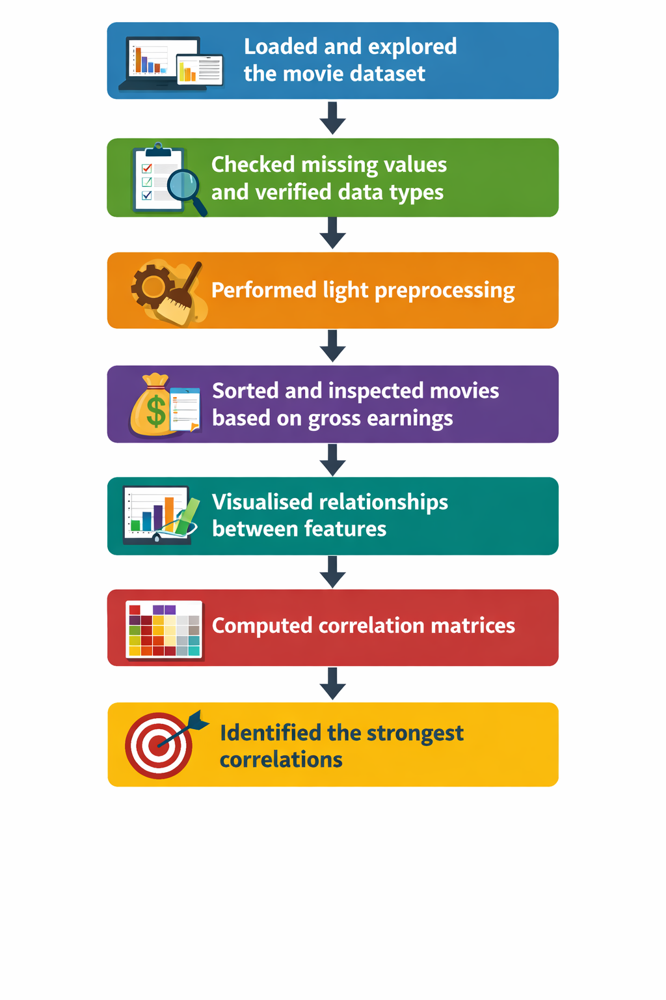
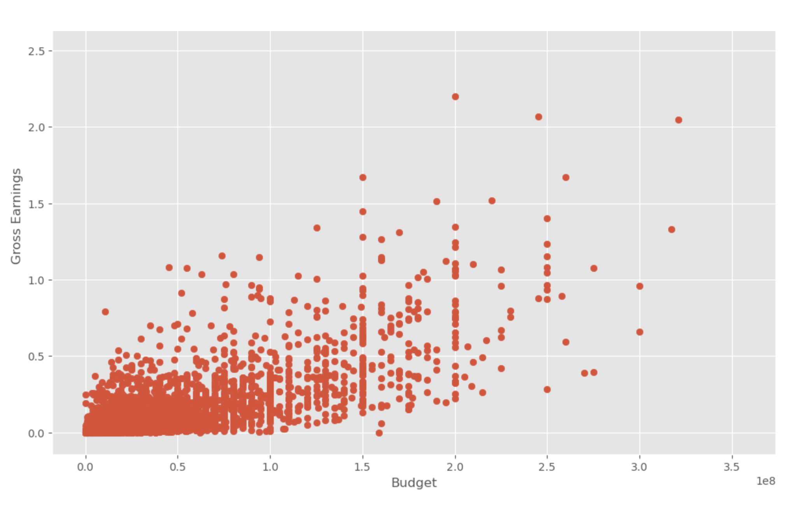
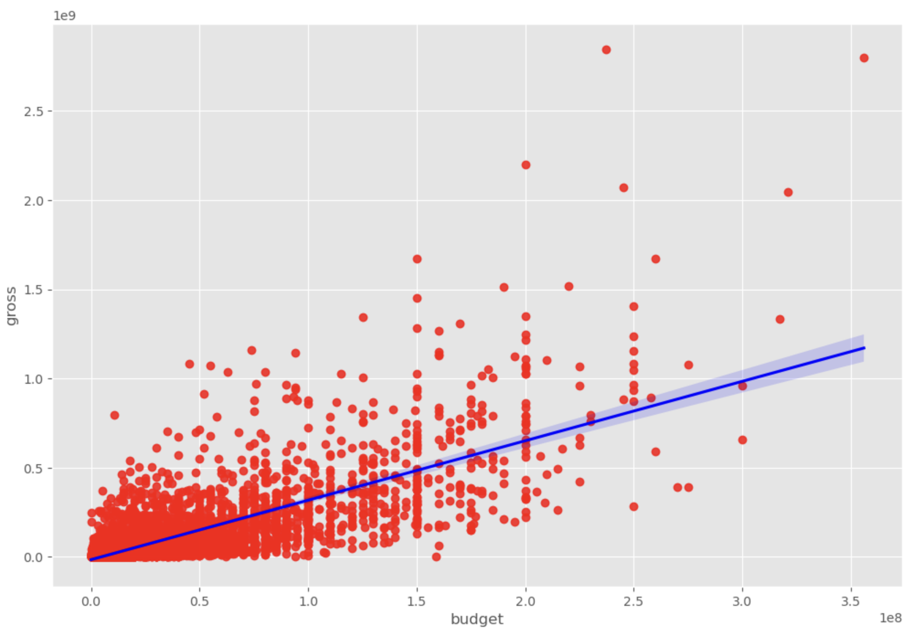
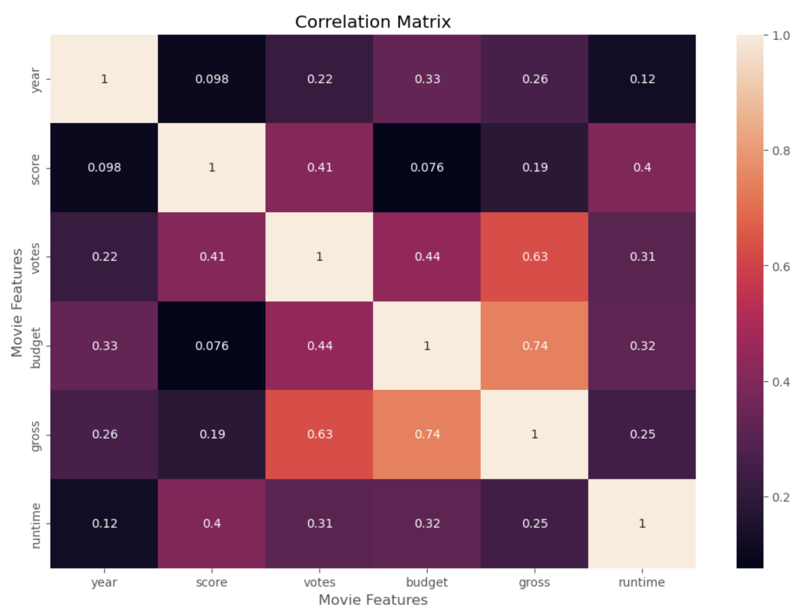
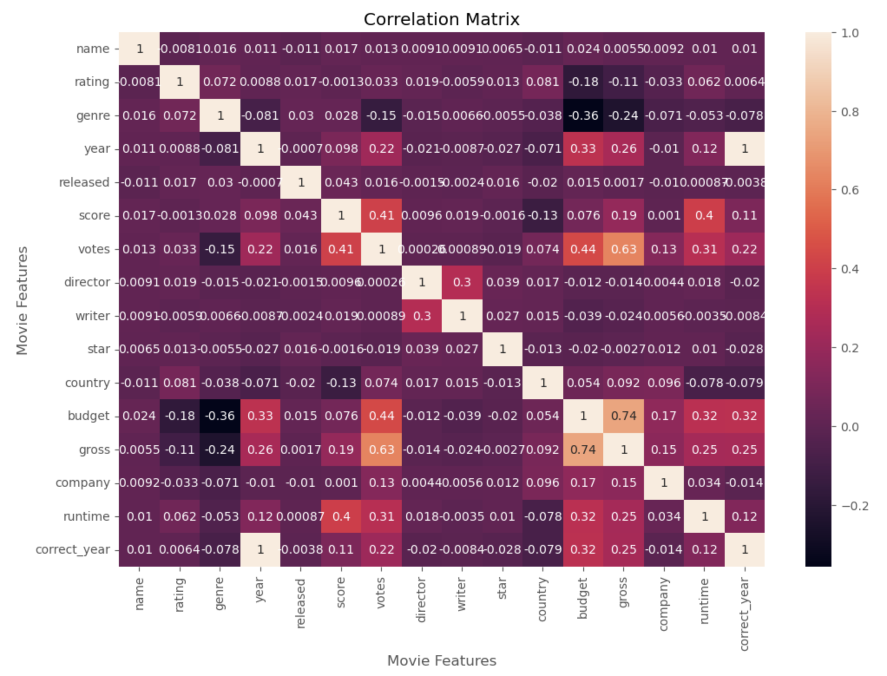

# Movie Data Analysis and Visualisation

## Project Overview

This project focuses on analysing a movie dataset using Python to understand which features are most strongly related to a movie’s gross earnings.

The main objectives of this project are to:

- Load and explore the movie dataset
- Check and understand missing values across columns
- Perform light preprocessing to prepare data for analysis
- Visualise relationships between key variables (Budget, Gross, Votes)
- Perform correlation analysis on numeric features
- Convert categorical features into numeric codes to analyse correlations across all columns
- Identify the highest correlated feature pairs

This project demonstrates a practical Exploratory Data Analysis (EDA) workflow using Python, ending with correlation-based insights.

---

## Dataset Description

The dataset contains information about movies, including:

- Name
- Rating
- Genre
- Year
- Released (date text)
- Score
- Votes
- Director
- Writer
- Star
- Country
- Budget
- Gross
- Company
- Runtime

The dataset contains both:

- *Categorical Features*
- *Numerical Features*

which makes it suitable for correlation analysis and visual exploration.

---

## Project Workflow

The following workflow outlines the key steps performed in this project:

  

---

## Data Preprocessing

Only light preprocessing was performed because the project focus was exploratory analysis and correlation insights.

The following preprocessing steps were carried out:

- Checked missing and null values across all columns
- Converted Budget and Gross columns into integer format
- Created a new column Correct Year by extracting the year from the Released column
- Sorted records by Gross earnings for exploration
- Checked for duplicate rows
- Converted categorical (object) columns into numeric category codes for correlation analysis

---

## Missing Values Summary

Missing values were checked for each column to understand data quality before analysis.

The most notable missing values found were:

- Budget has a large portion of missing values
- Gross has some missing values
- A few other columns contain small amounts of missing values

This helped guide interpretation of correlations and plots.

---

## Exploratory Data Analysis (EDA)

EDA was performed to understand:

- The relationship between Budget and Gross earnings
- How strongly Votes relate to Gross earnings
- Overall correlation patterns across numeric features
- Correlation patterns across all features after numerizing categorical columns

Visualisations created during EDA include:

- Scatter Plot of Budget vs Gross

  

  
- Regression Plot of Budget vs Gross

  

  
- Heatmap of correlation matrix (numeric features)

  

- Heatmap of correlation matrix (all features after numerizing)

  

---

## Correlation Analysis

Two correlation approaches were used:

- Correlation on numeric features only
- Correlation on all features by converting categorical columns into numeric codes

High correlation pairs were then identified and filtered to highlight the most meaningful relationships.

---

## Key Insights

The analysis highlights the following key relationships:

- Budget has a strong positive correlation with Gross earnings
- Votes also show a strong positive correlation with Gross earnings
- The extracted Correct Year is highly consistent with the Year column (as expected)

### Top Feature Correlations

| Feature 1 | Feature 2 | Correlation |
|-----------|-----------|-------------|
| Gross     | Budget    | 0.740395    |
| Gross     | Votes     | 0.630757    |

Overall, Budget and Votes are the strongest indicators associated with Gross earnings in this dataset.

---

## Tools & Libraries Used

- Python
- Pandas
- NumPy
- Matplotlib
- Seaborn

---

## Future Improvements

- Handle missing Budget values using filtering or imputation strategies
- Add feature scaling and more advanced modelling (optional)
- Explore genre-based and rating-based comparisons
- Create a dashboard-style summary of key insights
- Compare correlation results with regression or tree-based models

---

## Author

### Samad Zaheer

Master of Information Technology (Data Science)  
Queensland University of Technology (QUT)