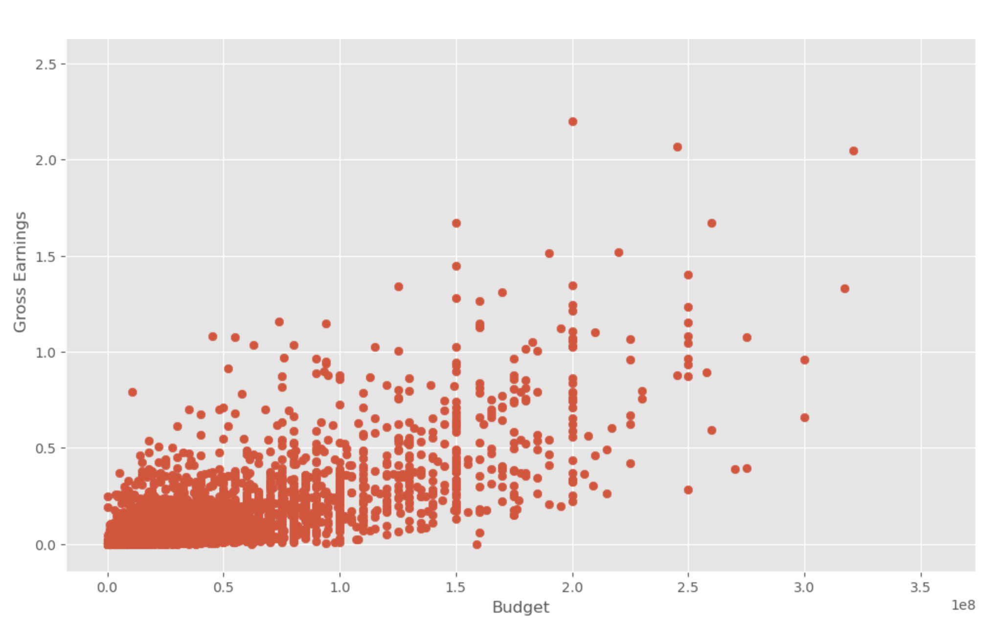
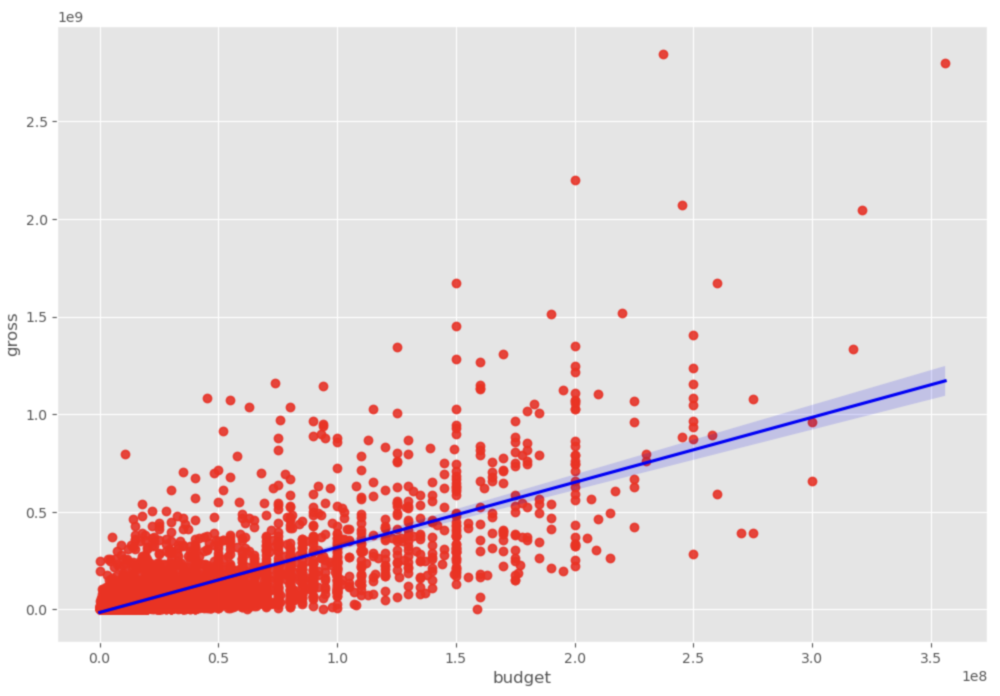
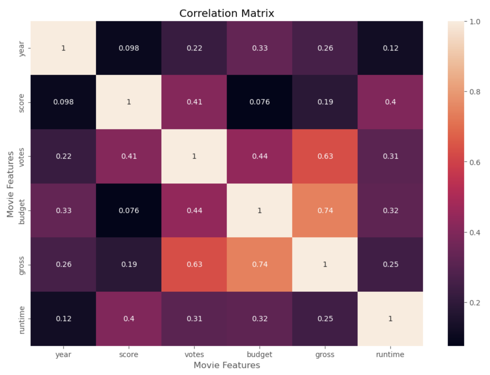
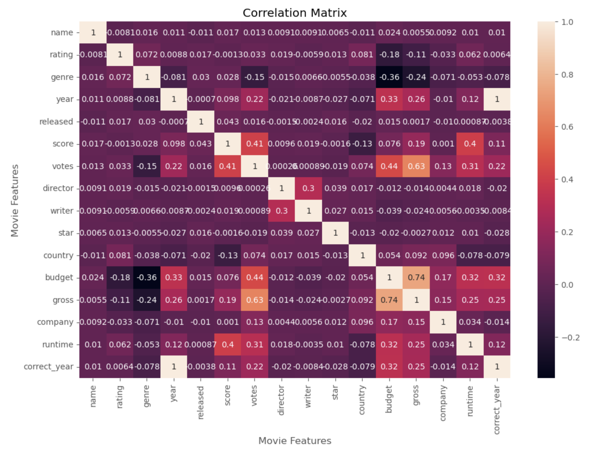
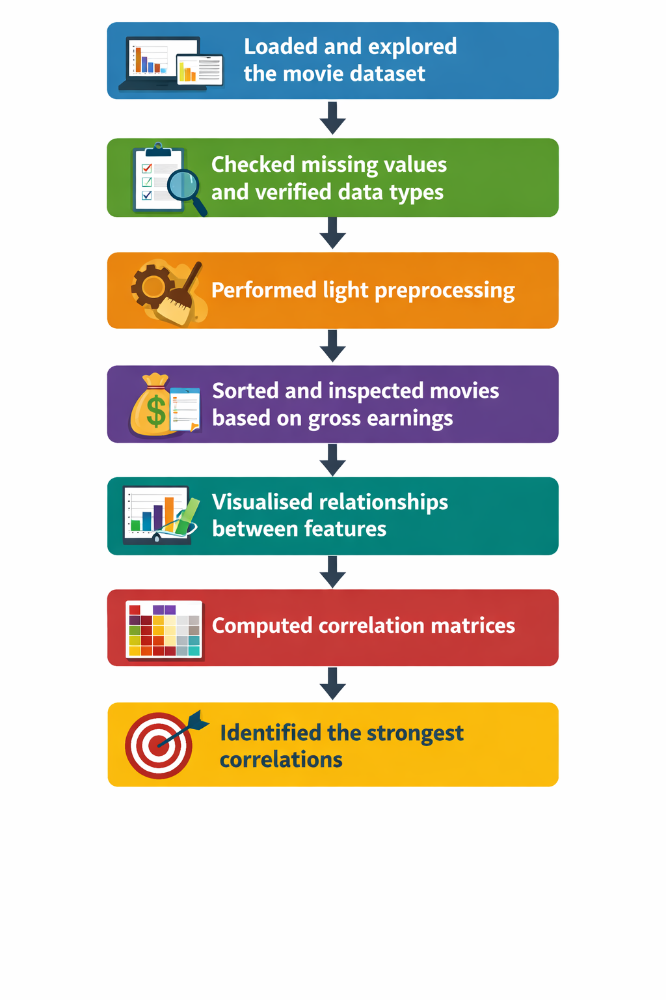

# Movie Data Analysis & Visualisation

Exploratory data analysis identifying the features most strongly correlated with box office gross earnings across 7,668 films — with directly actionable findings for studio acquisition teams and streaming platforms.

---

## Project Overview

What actually drives a film's commercial success — star power, critic ratings, or raw budget? This analysis cuts through industry intuition with data, examining 7,668 movies to quantify which variables most strongly predict gross earnings. Using regression plots, annotated heatmaps, and correlation analysis, the project surfaces a clear, evidence-based story about the economics of the film industry.

The findings are directly actionable for studio acquisition teams and streaming platforms deciding where to allocate production investment.

---

## Dataset

- **Source:** Web-scraped movie metadata dataset
- **Size:** 7,668 films
- **File:** `movies.csv`

| Feature | Type | Description |
|---------|------|-------------|
| name, rating, genre, year | Categorical | Film metadata |
| score | Numeric | Critic/IMDb rating |
| votes | Numeric | Audience vote count |
| director, writer, star | Categorical | Key creative roles |
| budget, gross | Numeric | Financial figures |
| company, country, runtime | Categorical/Numeric | Production details |

**Data quality notes:** Budget and Gross had the largest proportion of missing values; these were noted and accounted for in correlation interpretation.

---

## Approach

1. **Loading & exploration** — loaded dataset, profiled missing values across all columns, noted which features had significant gaps
2. **Preprocessing** — converted Budget and Gross to integer format; extracted correct release year from `Released` date strings into a new `Correct_Year` column; sorted by Gross; checked for and removed duplicates
3. **Visual EDA** — scatter plot and regression plot of Budget vs Gross; regression plot of Votes vs Gross
4. **Correlation analysis (numeric)** — computed Pearson correlation matrix on numeric features; generated annotated heatmap
5. **Correlation analysis (all features)** — converted categorical columns to numeric codes; recomputed full correlation matrix to identify cross-type relationships
6. **Top pair extraction** — filtered high-correlation pairs to surface the most meaningful relationships

Visualisations produced:

<p align="center">
  
</p>

<p align="center">
  
</p>

<p align="center">
  
</p>

<p align="center">
  
</p>

<p align="center">
  
</p>

---

## Key Findings

| Feature 1 | Feature 2 | Correlation |
|-----------|-----------|-------------|
| Gross | Budget | **0.7404** |
| Gross | Votes | **0.6308** |

- **Budget is the single strongest predictor** of gross earnings (r = 0.74) — high-budget productions carry a measurable return premium, supporting continued investment in blockbuster-scale releases
- **Audience votes are the second-strongest predictor** (r = 0.63) — a proxy for word-of-mouth reach and audience engagement, not critic endorsement
- **Critic score (IMDb rating) has a weak correlation with gross** — commercial success and critical reception are largely independent variables in this dataset
- **Streaming platforms should prioritise audience engagement signals** over critic scores when predicting revenue potential for acquisition decisions
- The `Correct_Year` column extracted from `Released` aligns closely with `Year` (as expected), validating the date parsing approach

---

## How to Run

```bash
git clone https://github.com/SamadZaheer/Movie-Dataset---Analysis-and-Visualization.git
cd Movie-Dataset---Analysis-and-Visualization
pip install -r requirements.txt
jupyter notebook "Movie Data Analysis.ipynb"
```

---

## Author

**Samad Zaheer** — Master of Information Technology (Data Science), Queensland University of Technology (QUT)
